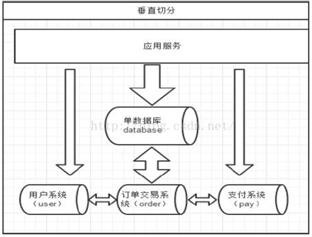
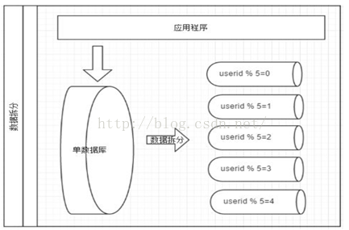
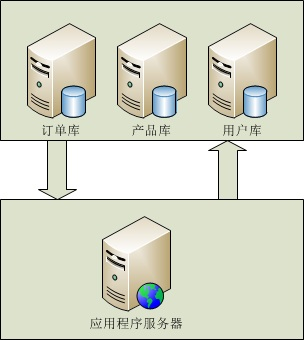

# [数据库垂直拆分 水平拆分]

​        当我们使用读写分离、缓存后，数据库的压力还是很大的时候，这就需要使用到数据库拆分了。

​        

​         数据库拆分简单来说，就是指通过某种特定的条件，按照某个维度，将我们存放在同一个数据库中的数据分散存放到多个数据库（主机）上面以达到分散单库（主机）负载的效果。 

 

​        切分模式： 垂直（纵向）拆分、水平拆分。

 

垂直拆分

 

​        专库专用

 

​        一个数据库由很多表的构成，每个表对应着不同的业务，垂直切分是指按照业务将表进行分类，分布到不同的数据库上面，这样也就将数据或者说压力分担到不同的库上面，如下图：

​        

优点：

​        1. 拆分后业务清晰，拆分规则明确。

​        2. 系统之间整合或扩展容易。

​        3. 数据维护简单。

 

缺点：

​        1. 部分业务表无法join，只能通过接口方式解决，提高了系统复杂度。

​        2. 受每种业务不同的限制存在单库性能瓶颈，不易数据扩展跟性能提高。

​        3. 事务处理复杂。

 

水平拆分

 

​        垂直拆分后遇到单机瓶颈，可以使用水平拆分。相对于垂直拆分的区别是：垂直拆分是把不同的表拆到不同的数据库中，而水平拆分是把同一个表拆到不同的数据库中。

 

​        相对于垂直拆分，水平拆分不是将表的数据做分类，而是按照某个字段的某种规则来分散到多个库之中，每个表中包含一部分数据。简单来说，我们可以将数据的水平切分理解为是按照数据行的切分，就是将表中 的某些行切分到一个数据库，而另外的某些行又切分到其他的数据库中，主要有分表，分库两种模式，如图：

​           

​          

优点：

​        1. 不存在单库大数据，高并发的性能瓶颈。

​        2. 对应用透明，应用端改造较少。     

​        3. 按照合理拆分规则拆分，join操作基本避免跨库。

​        4. 提高了系统的稳定性跟负载能力。

 

缺点：

​        1. 拆分规则难以抽象。

​        2. 分片事务一致性难以解决。

​        3. 数据多次扩展难度跟维护量极大。

​        4. 跨库join性能较差。

 

拆分的处理难点

 

两张方式共同缺点

 

​        1. 引入分布式事务的问题。

​        2. 跨节点Join 的问题。

​        3. 跨节点合并排序分页问题。

 

针对数据源管理，目前主要有两种思路：

 

​        A. 客户端模式，在每个应用程序模块中配置管理自己需要的一个（或者多个）数据源，直接访问各个 数据库，在模块内完成数据的整合。 

​        优点：相对简单，无性能损耗。   

​        缺点：不够通用，数据库连接的处理复杂，对业务不够透明，处理复杂。

 

​       B. 通过中间代理层来统一管理所有的数据源，后端数据库集群对前端应用程序透明；   

​        优点：通用，对应用透明，改造少。   

​        缺点：实现难度大，有二次转发性能损失。

 

拆分原则

​    

​        1. 尽量不拆分，架构是进化而来，不是一蹴而就。(SOA)

​        2. 最大可能的找到最合适的切分维度。

​        3. 由于数据库中间件对数据Join 实现的优劣难以把握，而且实现高性能难度极大，业务读取  尽量少使用多表Join -尽量通过数据冗余，分组避免数据垮库多表join。

​        4. 尽量避免分布式事务。

​        5. 单表拆分到数据1000万以内。

 

切分方案

​    

​        范围、枚举、时间、取模、哈希、指定等

 

案例分析

 

场景一

建立一个历史his系统，将公司的一些历史个人游戏数据保存到这个his系统中，主要是写入，还有部分查询，读写比约为1:4；由于是所有数据的历史存取，所以并发要求比较高； 

 

分析：

历史数据

写多都少

越近日期查询越频繁？

什么业务数据？用户游戏数据

有没有大规模分析查询？

数据量多大？

保留多久？

机器资源有多少？

 

方案1：按照日期每月一个分片

带来的问题：1.数据热点问题（压力不均匀）

 

方案2：按照用户取模，  --by Jerome 就这个比较合适了

带来的问题：后续扩容困难

 

方案3：按用户ID范围分片（1-1000万=分片1，xxx）

带来的问题：用户活跃度无法掌握，可能存在热点问题

 

场景二

建立一个商城订单系统，保存用户订单信息。

 

分析：

电商系统

一号店或京东类？淘宝或天猫？

实时性要求高

存在瞬时压力

基本不存在大规模分析

数据规模？

机器资源有多少？

维度？商品？用户？商户？

 

方案1：按照用户取模，

带来的问题：后续扩容困难

 

方案2：按用户ID范围分片（1-1000万=分片1，xxx）

带来的问题：用户活跃度无法掌握，可能存在热点问题

 

方案3：按省份地区或者商户取模

数据分配不一定均匀

 

场景3

上海公积金，养老金，社保系统

 

分析：

社保系统

实时性要求不高

不存在瞬时压力

大规模分析？

数据规模大

数据重要不可丢失

偏于查询？

 

方案1：按照用户取模，

带来的问题：后续扩容困难

 

方案2：按用户ID范围分片（1-1000万=分片1，xxx）

带来的问题：用户活跃度无法掌握，可能存在热点问题

 

方案3：按省份区县地区枚举

数据分配不一定均匀

 

 

 

​        数据库问题解决后，应用面对的新挑战就是拆分应用等

 

 

垂直拆分

　　垂直拆分就是要把表按模块划分到不同数据库表中（当然原则还是不破坏第三范式），这种拆分在大型网站的演变过程中是很常见的。当一个网站还在很小的时候，只有小量的人来开发和维护，各模块和表都在一起，当网站不断丰富和壮大的时候，也会变成多个子系统来支撑，这时就有按模块和功能把表划分出来的需求。其实，相对于垂直切分更进一步的是服务化改造，说得简单就是要把原来强耦合的系统拆分成多个弱耦合的服务，通过服务间的调用来满足业务需求看，因此表拆出来后要通过服务的形式暴露出去，而不是直接调用不同模块的表，淘宝在架构不断演变过程，最重要的一环就是服务化改造，把用户、交易、店铺、宝贝这些核心的概念抽取成独立的服务，也非常有利于进行局部的优化和治理，保障核心模块的稳定性

　　垂直拆分：单表大数据量依然存在性能瓶颈

　　**水平拆分**

　　上面谈到垂直切分只是把表按模块划分到不同数据库，但没有解决单表大数据量的问题，而水平切分就是要把一个表按照某种规则把数据划分到不同表或数据库里。例如像计费系统，通过按时间来划分表就比较合适，因为系统都是处理某一时间段的数据。而像SaaS应用，通过按用户维度来划分数据比较合适，因为用户与用户之间的隔离的，一般不存在处理多个用户数据的情况，简单的按user_id范围来水平切分

　　通俗理解：水平拆分行，行数据拆分到不同表中， 垂直拆分列，表数据拆分到不同表中

　　**垂直与水平联合切分**

　　由上面可知垂直切分能更清晰化模块划分，区分治理，水平切分能解决大数据量性能瓶颈问题，因此常常就会把两者结合使用，这在大型网站里是种常见的策略

　　案例：

　　以mysql为例，简单购物系统暂设涉及如下表：

　　1.产品表（数据量10w，稳定）

　　2.订单表（数据量200w，且有增长趋势）

　　3.用户表 （数据量100w，且有增长趋势）

　　以mysql为例讲述下水平拆分和垂直拆分，mysql能容忍的数量级在百万静态数据可以到千万

　　**垂直拆分：**

　　解决问题：

　　表与表之间的io竞争

　　不解决问题：

　　单表中数据量增长出现的压力

　　方案：

　　把产品表和用户表放到一个[**server**]()上

　　订单表单独放到一个server上

　**　水平拆分：**

　　解决问题：

　　单表中数据量增长出现的压力

　　不解决问题：

　　表与表之间的io争夺

　　方案：

　　用户表通过性别拆分为男用户表和女用户表

　　订单表通过已完成和完成中拆分为已完成订单和未完成订单

　　产品表 未完成订单放一个server上

　　已完成订单表盒男用户表放一个server上

　　女用户表放一个server上(女的爱购物)

 

**2.2.7 读写分离后，数据库又遇到瓶颈**

通过读写分离以及在某些场景用分布式存储系统替换关系型数据库的方式，能够降低主库的压力，解决数据存储方面的问题。不过随着业务的发展，我们的主库也会遇到瓶颈。我们的网站演进到现在，交易、商品、用户的数据还都在一个数据库中。尽管采取了增加缓存、读写分离的方式，这个数据库的压力还是在继续增加，因此我们需要去解决这个问题，我们有数据垂直拆分和水平拆分两种选择。

**2.2.7.1 专库专用，数据垂直拆分**

垂直拆分的意思是把数据库中不同的业务数据拆分到不同的数据库中。结合现在的例子，就是把交易、商品、用户的数据分开，

这样的变化给我们带来的影响是什么呢？应用需要配置多个数据源，这就增加了所需的配置，不过带来的是每个数据库连接池的隔离。不同业务的数据从原来的一个数据库中拆分到了多个数据库中，那么就需要考虑如何处理原来单机中跨业务的事务。一种办法是使用分布式事务，其性能要明显低于之前的单机事务；而另一种办法就是去掉事务或者不去追求强事务支持，则原来在单库中可以使用的表关联的查询也就需要改变实现了。

对数据进行垂直拆分之后，解决了把所有业务数据放在一个数据库中的压力问题。并且也可以根据不同业务的特点进行更多优化。

 

**2.2.7.2 垂直拆分后的单机遇到瓶颈，数据水平拆分**

与数据垂直拆分对应的还有数据水平拆分。数据水平拆分就是把同一个表的数据拆到两个数据库中。产生数据水平拆分的原因是某个业务的数据表的数据量或者更新量达到了单个数据库的瓶颈，这时就可以把这个表拆到两个或者多个数据库中。数据水平拆分与读写分离的区别是，读写分离解决的是读压力大的问题，对于数据量大或者更新量的情况并不起作用。数据水平拆分与数据垂直拆分的区别是，垂直拆分是把不同的表拆到不同的数据库中，而水平拆分是把同一个表拆到不同的数据库中。例如，经过垂直拆分后，用户表与交易表、商品表不在一个数据库中了，如果数据量或者更新量太大，我们可以进一步把用户表拆分到两个数据库中，它们拥有结构一模一样的用户表，而且每个库中的用户表都只涵盖了一部分的用户，两个数据库的用户合在一起就相当于没有拆分之前的用户表。我们先来简单看一下引入数据水平拆分后的结构，如图2-21 所示。

我们来分析一下水平拆分后给业务应用带来的影响。

首先，访问用户信息的应用系统需要解决SQL 路由的问题，因为现在用户信息分在了两个数据库中，需要在进行数据库操作时了解需要操作的数据在哪里。

此外，主键的处理也会变得不同。原来依赖单个数据库的一些机制需要变化，例如原来使用Oracle 的Sequence 或者MySQL 表上的自增字段的，现在不能简单地继续使用了。并且在不同的数据库中也不能直接使用一些数据库的限制来保证主键不重复了。

 

 

最后，由于同一个业务的数据被拆分到了不同的数据库中，因此一些查询需要从两个数据库中取数据，如果数据量太大而需要分页，就会比较难处理了。

不过，一旦我们能够完成数据的水平拆分，我们将能够很好地应对数据量及写入量增长的情况。具体如何完成数据水平拆分，在后面分布式数据访问层的章节中我们将进行更加详细的介绍。

 

**2.2.8 数据库问题解决后，应用面对的新挑战**

**2.2.8.1 拆分应用**

前面所讲的读写分离、分布式存储、数据垂直拆分和数据水平拆分都是在解决数据方面的问题。下面我们来看看应用方面的变化。

之前解决了应用服务器从单机到多机的扩展，应用就可以在一定范围内水平扩展了。随着业务的发展，应用的功能会越来越多，应用也会越来越大。我们需要考虑如何不让应用持续变大，这就需要把应用拆开，从一个应用变为两个甚至多个应用。我们来看两种方式。

第一种方式，根据业务的特性把应用拆开。在我们的例子中，主要的业务功能分为三大部分：交易、商品和用户。我们可以把原来的一个应用拆成分别以交易和商品为主的两个应用，对于交易和商品都会有涉及用户的地方，我们让这两个系统自己完成涉及用户的工作，而类似用户注册、登录等基础的用户工作，可以暂时交给两系统之一来完成（注意，我们在这里主要是通过例子说明拆分的做法），如图2-22 所示，这样的拆分可以使大的应用变小。

 

 

我们还可以按照用户注册、用户登录、用户信息维护等再拆分，使之变成三个系统。不过，这样拆分后在不同系统中会有一些相似的代码，例如用户相关的代码。如何能够保证这部分代码的一致以及如何对其复用是需要解决的问题。此外，按这样的方式拆分出来的新系统之间一般没有直接的相互调用。而且，新拆出来的应用可能会连接同样的数据库。

来看一个具体的例子，如图2-23 所示。

我们根据业务的不同功能拆分了几个业务应用，而且这些业务应用之间不存在直接的调用，它们都依赖底层的数据库、缓存、文件系统、搜索等。这样的应用拆分确实能够解决当下的一些问题，不过也有一些缺点。  

 

 

**2.2.8.2 走服务化的路**

我们再来看一下服务化的做法。图2-24 是一个示意图。从中可以看到我们把应用分为了三层，处于最上端的是Web 系统，用于完成不同的业务功能；处于中间的是一些服务中心，不同的服务中心提供不同的业务服务；处于下层的则是业务的数据库。当然，我们在这个图中省去了缓存等基础的系统，因此可以说是服务化系统结构的一个简图。

 

 

图2-24 与之前的图相比有几个很重要的变化。首先，业务功能之间的访问不仅是单机内部的方法调用了，还引入了远程的服务调用。其次，共享的代码不再是散落在不同的应用中了，这些实现被放在了各个服务中心。第三，数据库的连接也发生了一些变化，我们把与数据库的交互工作放到了服务中心，让前端的Web 应用更加注重与浏览器交互的工作，而不必过多关注业务逻辑的事情。连接数据库的任务交给相应的业务服务中心了，这样可以降低数据库的连接数。而服务中心不仅把一些可以共用的之前散落在各个业务的代码集中了起来，并且能够使这些代码得到更好的维护。第四，通过服务化，无论是前端Web 应用还是服务中心，都可以是由固定小团队来维护的系统，这样能够更好地保持稳定性，并能更好地控制系统本身的发展，况且稳定的服务中心日常发布的次数也远小于前端Web 应用，因此这个方式也减小了不稳定的风险。

要做到服务化还需要一些基础组件的支撑，在后面服务框架的章节我们会具体介绍。

 

 

通过某种特定的条件，将存放在同一个[数据库]中的数据分散存放到多个数据库上，实现分布存储，通过路由规则路由访问特定的数据库，这样一来每次访问面对的就不是单台[服务器]了，而是N台[服务器]，这样就可以降低单台机器的负载压力。提示：sqlserver 2005版本之后，可以友好的支持“表分区”。

　　垂直(纵向)拆分：是指按功能模块拆分，比如分为订单库、商品库、用户库...这种方式多个数据库之间的表结构不同。

　　水平(横向)拆分：将同一个表的数据进行分块保存到不同的数据库中，这些数据库中的表结构完全相同。

▲(纵向拆分)

▲(横向拆分)

　　**1，实现原理**：使用垂直拆分，主要要看应用类型是否合适这种拆分方式，如系统可以分为，订单系统，商品管理系统，用户管理系统业务系统比较明的，垂直拆分能很好的起到分散数据库压力的作用。业务模块不明晰，耦合(表关联)度比较高的系统不适合使用这种拆分方式。但是垂直拆分方式并不能彻底解决所有压力问题，例如 有一个5000w的订单表，操作起来订单库的压力仍然很大，如我们需要在这个表中增加(insert)一条新的数据，insert完毕后，数据库会针对这张表重新建立索引，5000w行数据建立索引的系统开销还是不容忽视的，反过来，假如我们将这个表分成100个table呢，从table_001一直到table_100，5000w行数据平均下来，每个子表里边就只有50万行数据，这时候我们向一张只有50w行数据的table中insert数据后建立索引的时间就会呈数量级的下降，极大了提高了DB的运行时效率，提高了DB的并发量，这种拆分就是横向拆分

　　**2，实现方法**：垂直拆分，拆分方式实现起来比较简单，根据表名访问不同的数据库就可以了。横向拆分的规则很多，这里总结前人的几点，

　　(1)顺序拆分：如可以按订单的日前按年份才分，2003年的放在db1中，2004年的db2,以此类推。当然也可以按主键标准拆分。

　　优点：可部分迁移

　　缺点：数据分布不均，可能2003年的订单有100W，2008年的有500W。

　　(2)hash取模分： 对user_id进行hash(或者如果user_id是数值型的话直接使用user_id的值也可)，然后用一个特定的数字，比如应用中需要将一个数据库切分成4个数据库的话，我们就用4这个数字对user_id的hash值进行取模运算，也就是user_id%4,这样的话每次运算就有四种可能：结果为1的时候对应DB1;结果为2的时候对应DB2;结果为3的时候对应DB3;结果为0的时候对应DB4，这样一来就非常均匀的将数据分配到4个DB中。

　　优点：数据分布均匀

　　缺点：数据迁移的时候麻烦;不能按照机器性能分摊数据 。

　　(3)在认证库中保存数据库配置

　　就是建立一个DB，这个DB单独保存user_id到DB的映射关系，每次访问数据库的时候都要先查询一次这个数据库，以得到具体的DB信息，然后才能进行我们需要的查询操作。

　　优点：灵活性强，一对一关系

　　缺点：每次查询之前都要多一次查询，会造成一定的性能损失。

 